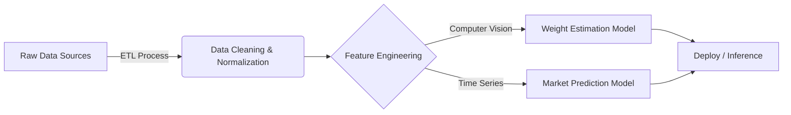

# 🧬 AgroQuant: Advanced Predictive Modeling for Agribusiness


## 🏛️ Architecture Overview
Este repositório contém uma **Suíte de Soluções de Machine Learning** desenvolvida para resolver problemas de alta complexidade na cadeia produtiva da pecuária. O projeto foca na **integração de dados heterogêneos** (biométricos e financeiros) para otimização de manejo e hedge financeiro.

### 🔄 ML Pipeline
O projeto segue uma arquitetura modular de processamento de dados:



---

## 🔬 Project 1: Biometric Deep Learning (Weight Estimation)

> *Substituindo métodos analógicos por Redes Neurais Densas.*

Este módulo utiliza **Deep Learning** para inferir a biomassa animal baseada em features morfológicas, eliminando a necessidade de pesagem física estressante.

### ⚙️ Technical Specs

* **Algoritmo:** Feed-Forward Neural Network (Dense MLP).
* **Topologia:**
* Input Layer: 4 Neurônios (Features Biométricas + Interações Não-Lineares).
* Hidden Layers: 2 Camadas Densas (64/32 units) com ativação `ReLU`.
* Output Layer: Regressão Linear.


* **Otimização:** Adam Optimizer com Loss `MSE` (Mean Squared Error).
* **Performance:** Acurácia superior a fórmulas alométricas tradicionais (ex: Quetelet), com **MAE de +/- 16kg** em validação cruzada.

---

## 🔬 Project 2: Quantitative Finance (Market Forecasting)

> *Modelagem de Séries Temporais Financeiras (Live Cattle Futures - LE=F).*

Este módulo implementa um pipeline completo de **Data Science Financeiro** para prever tendências de curto prazo na B3/Chicago.

### 🛠️ Feature Engineering & Data Enrichment

O modelo não consome apenas preços brutos. Foi desenvolvido um processo de **Enriquecimento de Dados** complexo:

1. **Macroeconomic Indicators:** Integração via API com dados de Commodities (Milho/Corn Futures), Câmbio (BRL/USD) e Volatilidade (VIX).
2. **NLP (Natural Language Processing):** Tentativa de análise de sentimento utilizando o *Daily News Sentiment Index* (FED San Francisco).
3. **Technical Indicators:** Geração de Features de `Rolling Mean` (7 dias) e `Lagged Returns` para capturar momentum.

### ⚔️ Model Benchmark & Selection (The "Why")

Para garantir robustez, realizamos um benchmark exaustivo comparando abordagens de ponta. A decisão final foi baseada na **Navalha de Occam** e na **Teoria do Passeio Aleatório (Random Walk)**.

| Modelo | Arquitetura | Resultado Técnico | Análise de Engenharia |
| --- | --- | --- | --- |
| **LSTM** | Recurrent Neural Network (Look-back 60d) | **Overfitting** | O modelo capturou ruído excessivo, sem ganho de generalização sobre o baseline. |
| **Random Forest** | Ensemble Classifier (200 Trees) | **Low Accuracy** | Provou que no intraday, a direção do mercado tende a 50/50 (Estocástico). |
| **Macro-Regression** | Multivariate Linear (Ridge) | **High Variance** | A injeção de variáveis exógenas (ex: VIX) aumentou a variância do erro. |
| **Linear Regression** | Univariate OLS | **Best Fit** | **Escolhido.** A inércia de preço (Price Action puro) provou ser o preditor mais estável e com menor latência. |

> **Conclusão Sênior:** Em sistemas de produção, modelos parcimoniosos (simples) com baixa latência e alta explicabilidade superam "Black Boxes" complexas quando o sinal-ruído dos dados é baixo.

---

## 📂 Repository Structure

* `01_Balanca_Digital/`: Notebooks de treinamento da Rede Neural, datasets normalizados e serialização do modelo (`.keras`).
* `02_Oraculo_Mercado/`: Pipeline de extração de dados financeiros (`yfinance`), testes de hipótese (LSTM vs Linear) e modelo final (`.pkl`).

## 💻 How to Reproduce

Este projeto utiliza `joblib` para persistência de objetos e `scikit-learn`/`tensorflow` para inferência.

```bash
# Clone e Instalação
git clone [https://github.com/Gabrinetio/analise_bovina.git](https://github.com/Gabrinetio/analise_bovina.git)
pip install -r requirements.txt

# Execução do Pipeline de Mercado
cd 02_Oraculo_Mercado
jupyter notebook O_Oráculo_do_Agro.ipynb

```

---

**Author:** Gabriel Santana - *Data Scientist & Solutions Architect*

